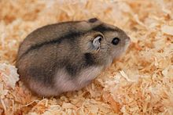
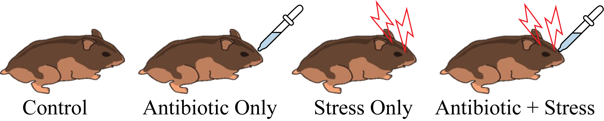
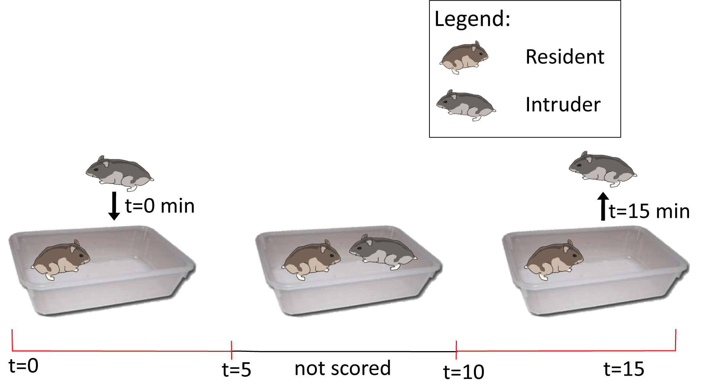
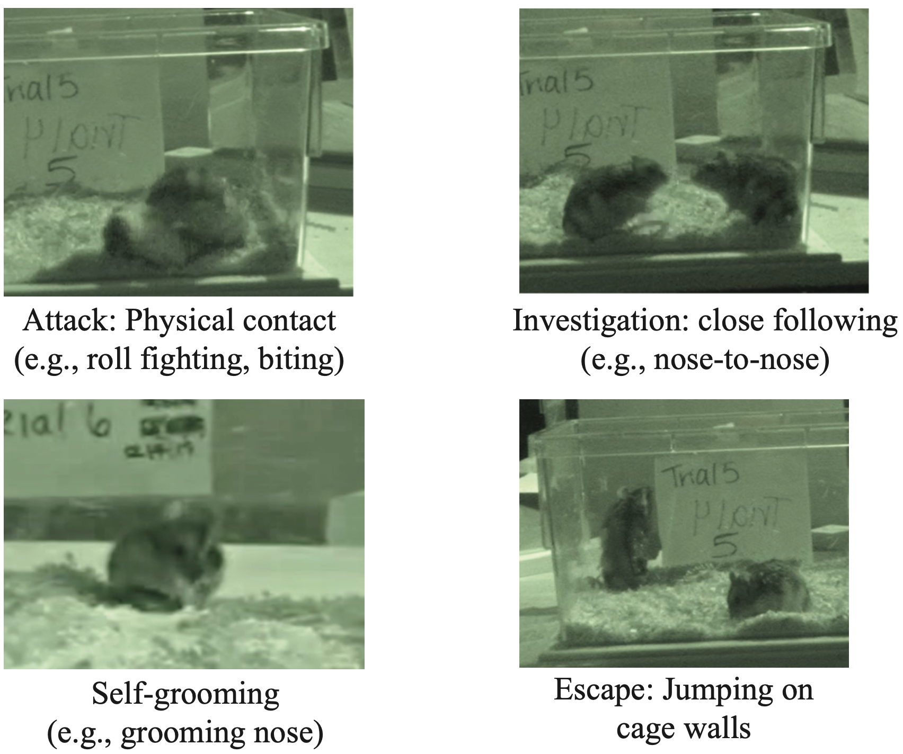
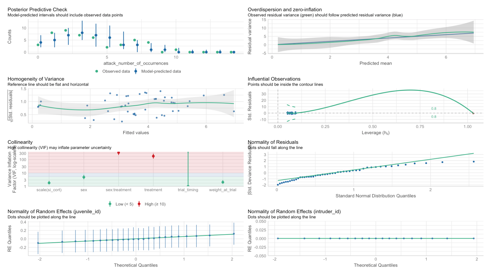

```{r setup chunk, include=FALSE}
if (!require("pacman")) install.packages("pacman"); library(pacman) # for rapid install if not in library
pacman::p_load("tidyverse", "janitor", "patchwork", "skimr", "readxl", "lme4", "lmerTest", "glmmADMB", "arm", "emmeans", "knitr", "kableExtra", "car", "performance", "broom", "broom.mixed", "easystats")

```

# Project background
Essentially all individuals experience social stress, which may be acute or chronic. Individuals differ in their behavioral and physiological responses to stressors, but what factors cause these individual differences is less clear. Manipulations to the maternal microbiome and maternal stress can have sex-specific effects on offspring social behaviors and may help explain variation in behavioral responses to prolonged stress. **My research project investigates how maternal environment affects differences in offspring social behavior during long bouts of stress in Siberian hamsters** (*Phodopus sungorus*, figure 1).<br>
<br>
```{r hamsterimage, echo=FALSE, out.width="40%", fig.align = "center", fig.cap = "**Figure 1.** Image of Siberian hamster *Phodopus sungorus*. Image attribution: Salzgeber, P. (2007). Phodopus sungorus. In Wikimedia Commons. https://commons.wikimedia.org/wiki/File:PhodopusSungorus_1.jpg"}

```

***

## Research questions <br>
**Question:** How does early development (i.e., maternal environment) affect whether offspring vary in their social behaviors during the course of a long-bout social stressor? <br>
**Hypothesis:** Maternal stress during offspring development has sex-specific effects on consistency in individual behavior during a long-bout social stressor <br>
**Predictions:** <br>
1. Female offspring from Stress Only mothers will display increased aggression throughout a long-bout stressor. <br>
2. Other offspring will not display consistent behaviors throughout the long-bout stressor. <br>


## Methods 
### Maternal treatment <br>
Pregnant females (n=34) were exposed to one of four treatments for ten days during pregnancy: control, antibiotic only, stress only, antibiotic + stress (figure 2) 
```{r maternaltreatment, echo=FALSE, out.width="60%", fig.align = "center", fig.cap = "**Figure 2.** Maternal treatment graphic depicting the four treatment groups."}

```

<br>

### Offspring behavioral trials <br>
Juvenile offspring (n=14 males, 11 females) were exposed to a 15 minute social stressor following a resident-intruder paradigm. The intruder was placed into the focal individual's (i.e., offspring's) cage for 15 minutes, and offspring behaviors towards the intruder were scored (figure 3). <br>
The first 5 minutes (t0-t5) and the last five minutes (t10-t15) of behaviors were scored and analyzed.
```{r scoring_methods, echo=FALSE, out.width="60%", fig.align = "center", fig.cap = "**Figure 3.**Offspring in late adolescence (51-56 days old) were exposed to a resident-intruder trial as above. The intruder was placed in the focal individual’s cage for 15 minutes. Time scored is shown by red line."}

```
<br>
**Four behaviors were scored: attack, investigation, escape, and grooming** (figure 4). <br> 
<br>
```{r behaviors, echo=FALSE, out.width="60%", fig.align = "center", fig.cap = "**Figure 4.** Actual screenshots of video data depicting the four social behaviors of interest."}

```


### Data cleaning
Below is the code used to clean the and prepare the data for analyses. Several columns were removed from the data frame because they were not used in this project (these were columns imported into the excel sheet from the original project in 2019).
```{r clean data, message=FALSE, warning=FALSE, results="hide"}
# Load data, clean names, view structure ####
hammies <- read_csv("../final_project/IU106_Social Behavior First and Last Five Minutes_Formatted_6-6-23.csv")
hammies <- janitor::clean_names(hammies)
names(hammies)
str(hammies)

# Remove columns that were not used in this project ####
columns_removed <- c("id", "aggression_number_assigned", "comp1", "comp2", "comp3", 
                     "aggression_score_freq", "aggression_score_duration")
hammies <- dplyr::select(hammies, -columns_removed)

# Create trial timing column, set appropriate columns as factors ####
tidy_hammies <- hammies %>% 
  mutate(trial_timing = as.factor(first_or_last_five_minutes)) %>% 
  mutate(treatment = as.factor(maternal_treatment)) %>% 
  mutate(juvenile_id = as.factor(juvenile_id)) %>% 
  dplyr::select(-first_or_last_five_minutes)

# Fix spelling of all "occurence" columns ####
tidy_hammies <- tidy_hammies %>% 
  mutate(attack_number_of_occurrences = attack_number_of_occurences) %>%
  mutate(chase_number_of_occurrences = chase_number_of_occurences) %>%
  mutate(groom_number_of_occurrences = groom_number_of_occurences) %>%
  mutate(investigation_number_of_occurrences = investigation_number_of_occurences) %>%
  mutate(jump_number_of_occurrences = jump_number_of_occurences) %>% 
  dplyr::select(-contains("occurences"))

str(tidy_hammies)
```

### Modeling Juvenile Behavior
We analyzed the number (i.e., frequency) and total duration of behavioral bouts in the first and last five minutes (t0-t5 vs. t10-t15). <br>
For each model, we first tested for a three-way interaction between maternal treatment, offspring sex, and trial timing. If no significant three-way interaction was detected, we tested for a two-way interaction between offspring sex and maternal treatment. Only significant interactions were retained in the model; non-significant interaction terms were removed.

#### Summary of models
All models had two random effects: intruder identity and resident (offspring) identity, to control for individual differences in behavior. 
All frequency models (GLMM's) used the bobyqa optimizer from the lme4 package for model fitting. 
```{r table1, echo=FALSE}
Response_variable <- c("Attack Frequency", "Attack Duration"," Investigation Frequency", "Investigation Duration", "Escape Frequency", "Escape Duration", "Grooming Frequency", "Grooming Duration")
Distribution <- c("Poisson, Log link function", "Gaussian, Identity link function", "Poisson, Log link function", "Gaussian, Identity link function", "Poisson, Log link function", "Gaussian, Identity link function","Poisson, Log link function", "Gaussian, Identity link function")
Fixed_Effects <-  c("Offspring sex, maternal treatment, trial timing, SI- CORT, offspring weight, offspring sex*maternal treatment interaction", 
                      "Offspring sex, maternal treatment, trial timing, SI-CORT, offspring weight", 
                      "Offspring sex, maternal treatment, trial timing, SI-CORT, offspring weight, offspring sex*maternal treatment*trial timing",
                      "Offspring sex, maternal treatment, trial timing, SI-CORT, offspring weight",
                      "Offspring sex, maternal treatment, trial timing, SI-CORT, offspring weight, offspring sex*maternal treatment*trial timing", 
                      "Offspring sex, maternal treatment, trial timing, SI-CORT, offspring weight",
                      "Offspring sex, maternal treatment, trial timing, SI-CORT, offspring weight",
                      "Offspring sex, maternal treatment, trial timing, SI-CORT, offspring weight, offspring sex* maternal treatment")
model_summary_table <- data.frame(Response_variable, Distribution, Fixed_Effects)
model_summary_table %>% 
  kable("pipe", col.names = c("Response Variable", "Distribution", "Fixed Effects"), caption = "**Table 1.** Summary of models run for each response variable.")

```

# Agression frequency
## Results
Our first model analyzes the effects of maternal treatment, offspring sex, and video timing on the frequency of aggressive behaviors. There was no significant three-way interaction, but we did detect a significant interaction between maternal treatment and offspring sex. Below is the code for model A.1. 
```{r modelA.1, include=TRUE, message=FALSE, warning=FALSE}
modelA.1 <- tidy_hammies %>% 
  glmer(attack_number_of_occurrences ~ sex*treatment+trial_timing+scale(si_cort)
        +weight_at_trial+(1|intruder_id)+(1|juvenile_id),family=poisson,
        glmerControl(optimizer="bobyqa"),data=.)
```

```{r table2, message=FALSE, warning=FALSE}
broom.mixed::tidy(modelA.1) %>% 
  kable("pipe", digits = 3, caption = "**Table 2.** Summary of model A.1, analyzing the interactive effects of maternal treatment and offspring sex on frequency of attack behaviors in the first and last five minutes of the resident-intruder trial.") %>% 
  kable_styling() %>%
  kableExtra::row_spec(.,c(4:6, 10), bold=TRUE) %>% 
  kableExtra::column_spec(column = 1:7, width = "200px")
```

Model A.1 is a poisson mixed model fitted to predict number of attack bouts. 
<br>

```{r aggression_freq_graph, echo=TRUE, message=FALSE, warning=FALSE, out.width="90%", fig.cap="**Figure 5.** Plot of aggression frequency by sex and trial timing."}
tidy_hammies %>% 
  ggplot(aes(x=interaction(trial_timing, sex),
             y = attack_number_of_occurrences))+
  geom_boxplot(aes(fill=treatment))+
  labs(x= "Trial timing", 
       y = "Number of attacks", 
       fill = "Maternal treatment")+
  theme(axis.line = element_line(color="black"),
        panel.grid.major = element_blank(), 
        panel.grid.minor = element_blank(), 
        panel.background = element_blank())
```
<br>

We then used the lsmeans function from the emmeans R package to conduct pairwise comparisons of the maternal treatment and sex interactions. lsmeans uses a corrected p-value since to minimize the likelihood of a type I error, since we are performing a large number of comparisons. After running the lsmeans, none of our pairwise comparisons are statistically significant using a p-value of 0.05. 
```{r lsmeans(modelA.1), echo=TRUE, eval=FALSE}
#pairwise comparisons with corrected p-value
lsmeans(modelA.1, pairwise~treatment, type = "response") # because there was a significant 2-way interaction, we are more interested in the interaction below.
lsmeans(modelA.1, pairwise~treatment*sex, type = "response") 
```

```{r table3, message=FALSE, warning=FALSE}
lsmeans_output <- lsmeans(modelA.1, pairwise~treatment*sex, type = "response")
lsmeans_contrasts <- lsmeans_output$contrasts
lsmeans_contrasts_df <- as.data.frame(lsmeans_contrasts)
lsmeans_contrasts_df %>% 
  kable("pipe", digits = 3, caption = "**Table 3.** lsmeans comparisons for attack frequency.") %>% 
  kable_styling() %>%
  kableExtra::row_spec(.,14, bold=TRUE) %>% 
  kableExtra::column_spec(column = 1:7, width = "200px")
```

## Model assumptions and validation
Below is the code my PI initially used to check model assumptions and check for overdispersion. 
```{r code_from_jess, echo=TRUE, eval=FALSE}
# * * Checking model assumptions ------------------------------------------
qqnorm(residuals(modelA.1))
qqline(residuals(modelA.1))
shapiro.test(residuals(modelA.1))


# * * Check overdispersion ------------------------------------------------
overdisp_fun <- function(modelA.1) {
  rdf <- df.residual(modelA.1)
  rp <- residuals(modelA.1,type="pearson")
  Pearson.chisq <- sum(rp^2)
  prat <- Pearson.chisq/rdf
  pval <- pchisq(Pearson.chisq, df=rdf, lower.tail=FALSE)
  c(chisq=Pearson.chisq,ratio=prat,rdf=rdf,p=pval)
}
overdisp_fun
overdisp_fun(modelA.1)

sum(residuals(modelA.1,type="pearson")^2)/(nrow(tidy_hammies)-length(fixef(modelA.1)-1))

vif(modelA.1)
```

Using the performance package we learned about in class, I simplified the overdispersion code, and used check_model to visualize vif and overdispersion. 
```{r check_modelA.1, echo=TRUE, eval=FALSE}
check_model(modelA.1)
```

```{r check_modelA.1_plot, echo=FALSE, message=FALSE, warning=FALSE, fig.align='center', out.width = "100%", fig.cap= "**Figure 6.** Output of performance::check_model function for model A.1."}

```

```{r check_overdispersion_A.1, echo=TRUE, message=FALSE, warning=FALSE}
performance::check_overdispersion(modelA.1)
```

# Aggression Duration 
We fitted a linear mixed model for the duration of attack behaviors in the first and last five minutes of the resident-intruder trial. The data were square-root transformed to assume a normal distribution. There were no significant interactions to predict attack behavior duration. 

```{r modelA.2, message=FALSE, warning=FALSE}
modelA.2 <- lmer(sqrt(attack_total_duration)~ sex+treatment+trial_timing+
                   scale(si_cort)+weight_at_trial+(1|intruder_id)+(1|juvenile_id),
                 data = tidy_hammies)
#summary(modelA.2)
broom.mixed::tidy(modelA.2) %>% 
  kable("pipe", digits = 3) %>% 
  kable_styling() %>%
  kableExtra::column_spec(column = 1:7, width = "200px")
```

# Summary and Conclusions 
***
- Overall, both frequency and duration of social behaviors decrease over a 15 minute trial <br>
- Maternal treatment has significant effects on attack frequency. <br>
- Maternal treatment has sex-specific effects on investigation frequency and duration, escape frequency, and grooming duration. <br>
- Trial timing has significant effects on escape duration. <br>
- This research suggests that early maternal experience affects behavior during long bouts of stress, and effects can be sex-specific <br>
- Mechanisms driving changes in social behaviors during long bouts of stress need to be explored further 
